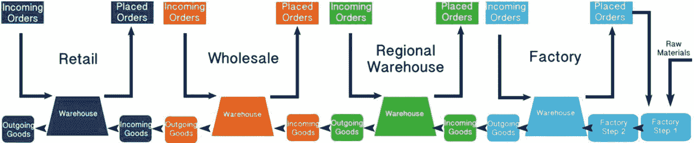

# 透明更新与公平贸易

请确定一个用例，其中`IoT`、区块链和人工干预可以形成一个去中心化生态系统，通过智能合约实现透明更新和公平贸易。

在理解了`IoT`与区块链集成的设计思路后，可以用 Azure 组件来构建平台。Azure 提供了多种选项，可通过其工作台配置区块链的选择，以连接`IoT`设备及其他逻辑应用。

根据所设计的架构，可以决定基于集成和预定义条件来调用区块链。例如，每当传感器超过阈值时，区块链就会记录此事件以用于审计。因此，当传感器数据超过阈值时，会调用区块链的 API。`DLT`服务确保对数据片段进行哈希处理和区块生成，并将其添加到区块链账本中。

然而，必须明确指出，对于直接连接到`IoT`的监控和报警系统，可能不需要区块链。因此，`Power BI`可以直接连接到链下`DB`，如图所示。区块链账本的作用是维护不可变的记录，支持审计以追溯传感数据的所有状态，确保在依赖传感数据的转发系统中维护共识等。

一个例子是氧气瓶的传感器数据，这些数据可能连接到生命支持、孵化中心、儿童护理等系统。由于需要维护此类信息以供医院审计，这些传感器数据可以存储在这个防篡改的区块链账本上，该账本与一系列设备相连。可以在所有节点上持续检查供应水平的状态。

## JSON 准备

为以下用例创建`JSON`配置伪代码和状态图：区块链平台捕获在调用智能合约条件时发生的每个状态和状态变化。通过参考车轮定位系统的官方智能合约流程，观察`JSON`准备步骤：

1. 定义用户类型。
2. 定义状态。
3. 绘制达到理想条件的过程/步骤。
4. 根据用户活动确定状态。

## 解决痛点

在本节中，让我们检查现有的链下场景及其缺点。作为解决方案架构师，请解决下图中区块链方案的痛点。

就库存成本、库存量和缺货情况等供需理解而言，该供应链的各个环节彼此高度脱节。这是因为所有利益相关者之间的沟通有限，并且最终用户的订单完全不透明。大多数此类小型实体各自为政地预测需求流，当不基于整个链的运动进行计算时，会导致成本增加。

要了解更多信息，请在此处玩游戏：[`https://beergame.masystem.se/`](https://beergame.masystem.se/)

现在我们已经了解了链下问题，请按照以下步骤设计一个完整的区块链解决方案：

1. 选择利益相关者和角色。
2. 选择区块链配置和连接。
3. 选择共识类型。
4. 根据步骤 3 选择平台。
5. 衡量可扩展性要求。
6. 如果需要，定义代币经济学。
7. 设置智能合约的状态和条件。
8. 绘制联盟区块链的链视图。

现在，你已经学会了为现实场景选择正确的共识形式，识别链下和链上活动，并在联盟中选择正确的对等节点、验证节点和区块链配置，接下来让我们看看以下部分中的解决方案。