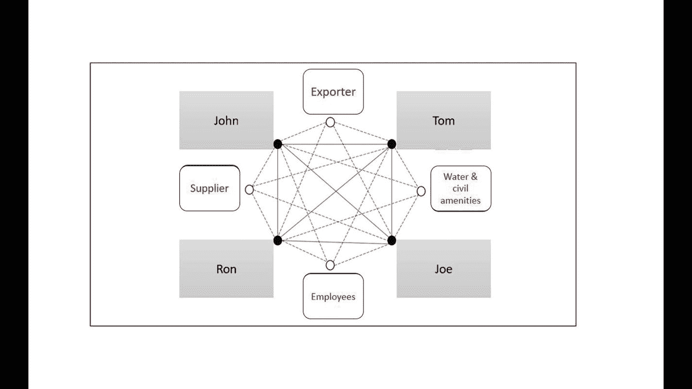
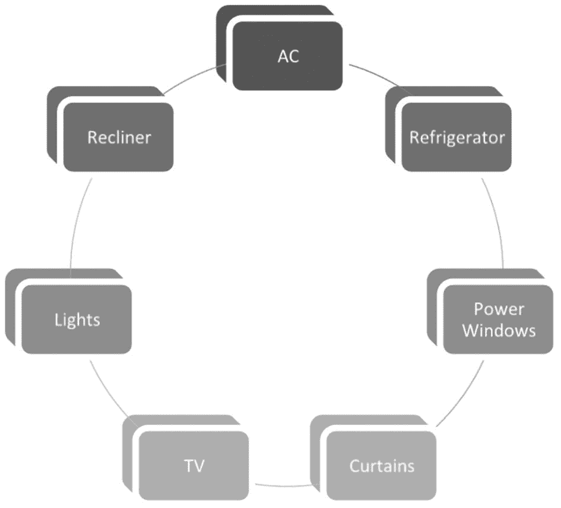
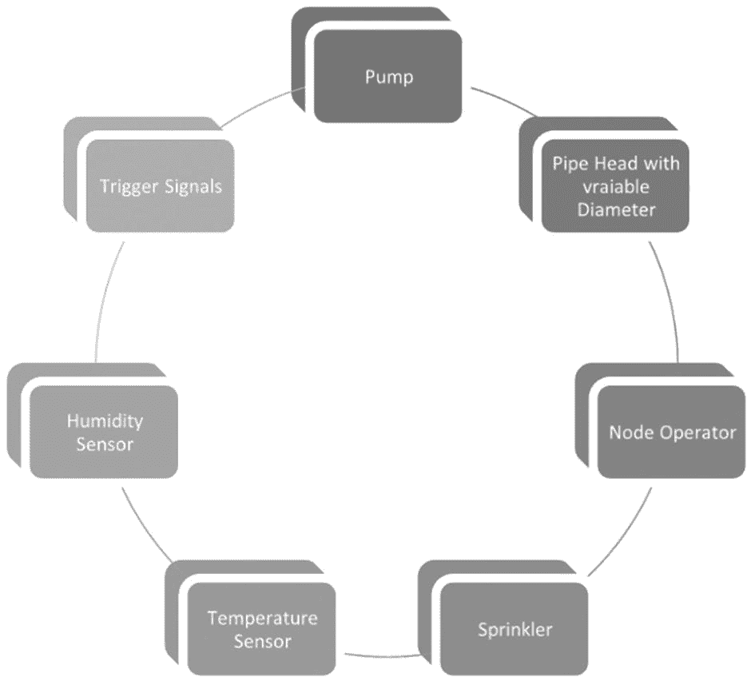
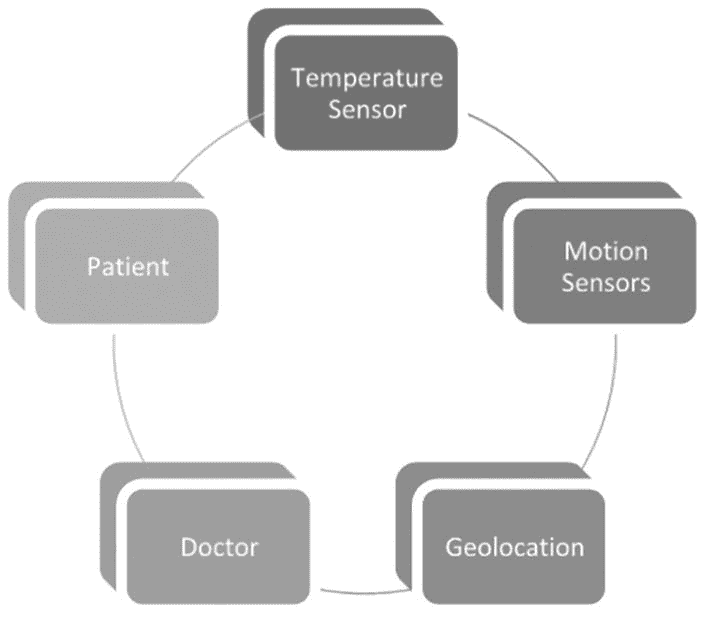
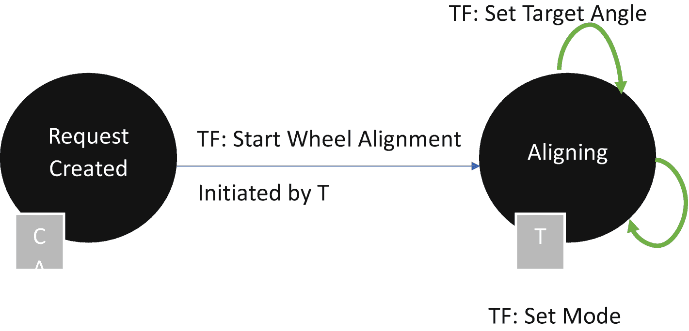

# 权益证明设计挑战

链上活动：

* 土地的出售/租赁
* 新增利益相关者
* 批准预算提案
* 资金分配
* 不动产建设

优势：

* 高权益持有者之间的控制权
* 即使是小权益持有者也有机会聚集形成多数
* 在链上透明地提出提案请求
* 基于共识跟踪资金分配
* 透明的投资决策

限制：

* 对少数投票者和利益相关者的控制力弱
* 权力集中在少数节点群体手中
* 多数利益相关者的僵化性和影响力
* 极低权益持有者群体缺乏决策途径
* 无法扩展到其他用户或第三方，这些用户或第三方没有权益参与链上的任何决策或服务

通过了解 `PoW` 和 `PoS` 方法的优缺点，像以太坊这样的现有区块链网络正在向 `PoW/PoS` 混合模式迁移。可以决定对一组活动（例如区块创建和生成）使用 `PoW`；并使用 `PoS` 根据智能合约进行验证和批准。这种方法的融合可能有助于消除攻击、偏见等缺点。在此处研究最新的以太坊黄皮书：

```
https://ethereum.github.io/yellowpaper/paper.pdf
```

通过研究黄皮书，可以构建这样的区块链配置，既可以使用 `Azure Workbench`，也可以简单地利用 Azure 上的一组 Ubuntu 服务器，通过 Docker 文件完成对节点的模拟。每个服务器可以是该服务器内虚拟实例上的一个节点或一组节点。一旦服务器分配的职责明确了，用户就可以将每个服务器的端点连接到事件注册器，该注册器可以调用其上的智能合约。


### 委托权益证明

链上活动：

- 权益责任的委托
- 任务分配与所有权
- 引入第三方节点、用户、服务
- 委托给新的农业专业人员，让其代表权益所有者积极工作
- 农场上的租户可被委托部分权益用于特定活动

优势：

- 共享去中心化的平衡责任形式
- 为低权益持有者提供途径，使其能获得委托权益以进行各类交易/活动
- 一种故障安全方法，可避免基于预先定义权益的权力集中
- 可根据链上委托节点的随机共识来引入新节点
- 允许在去中心化和包容性的基础上扩展链上活动
- 低能耗
- 低延迟时段

局限性：

- 易受中心化和偏见影响
- 委托节点可能形成虚假共识以制造虚假交易，这未必符合原始权益持有者的最佳利益
- 排除非委托权益持有者

权益证明的一个变体示例是 `Harmony`。`Harmony` 针对不同活动的不同权益要求实现了自适应阈值机制。达到权益价值的节点可以参与。`Harmony` 通过对网络、数据和交易状态进行完全分片来保持其可扩展性和去中心化。其分片机制在整个过程中是非均匀、可扩展且安全的。该共识将自适应 PoS 与 `FBFT`（快速拜占庭容错）相结合，使其具有容错性、分布式特点，并能支持高速交易。

### 有向无环图

活动：

1. 农场的每日视频推送
2. 基于传感器的物联网数据推送
3. 乔和罗恩之间的内部微交易
4. 本地化验证
5. 易于扩展到核心权益持有者之外的其它节点，用于水管、电力、公证等活动
6. 农产品出口
7. 种子、农资等物料的进口与库存管理
8. 用于安全、火灾隐患等情况的第三方集成触发器

优势：

1. 验证责任由后续区块生产者自然承接。
2. 共享账本信息管理无需每次都进行手动验证，从而允许物联网数据无缝附加到不可篡改的账本上。
3. 允许针对与某人（比如约翰）无关的交易，节点处于离线状态，同时仍为这类权益持有者保留记录以供日后了解。
4. 支持高速数据传输

劣势：

1. 与休眠节点断开连接
2. 数据摄取和验证的单行道模式
3. 易受攻击
4. 易趋于中心化

### 联邦拜占庭协议

活动：

1. 审批小额预算交易
2. 添加家庭提名人或受信任的已知节点用户
3. 现场维修工作的安排
4. 上传账单和收据
5. 现场常规活动

优势：

1. 高容错性
2. 支持更快的决策
3. 允许交易进行
4. 允许通过随机节点的精选验证来添加非平凡信息

劣势：

1. 仅适用于特定的一组限于非平凡决策的活动
2. 容错性假设认为绕过关键节点成员是可以接受的

### 重要性证明

约翰、罗恩、汤姆和乔决定对上述所有活动进行排序，并根据他们所从事的工作，决定在链上获取重要性得分。例如，约翰确保所有关于土地的文件都完美无缺并上传到了账本。因此，除了作为高权益的土地持有者，他还贡献了关键活动，从而在链上获得激励。同样，其他人也能通过完成任务来获得重要性。然而，高重要性得分的持有者可以指定下一个任务。得分每七天审查一次，验证者会根据得分进行轮换。这就是在重要性证明下锁定的协议。

活动：

1. 根据员工的贡献和行动给予激励
2. 激励与这条链互动的第三方实体
3. 激励为农场工作的高活跃度成员
4. 将绩效与重要性挂钩

优势：

1. 为像乔这样的低权益持有者提供了基于其贡献获得重要性和价值的途径
2. 允许根据参与度和投入程度来转移权力

劣势：

1. 囤积权力和链上产生的价值
2. 高度依赖网络驱动的活动
3. 在需要治理的某些情况下，去中心化可能导致完全失控。
4. 可能需要修订或硬分叉来更改策略

### 混合链

这样的区块链为所有参与方保持高度透明，同时也允许潜在买家拥有单一的共享真相来源。



### 数据与交易

| **公有链** | **私有链** |
| --- | --- |
| **数据** | **交易活动** | **数据** | **交易活动** |
| 一般人口统计信息 | 病理实验室审计 | 详细血液报告 | 医患交易 |
| 体重指数（BMI） | 医院检查 | 手术记录 | 医院患者交易 |
| 匿名名称 | 医生教育及工作经历 | 疗程详情 | 药房患者交易 |
| 诊断领域 | 购买一般医疗用品 | 家族病史 | 保险理赔交易 |
| 血型 | 购买医疗仪器及质量验证 | X 光片、超声波 | 金融交易 |
| 一般血液报告 | 献血 | 基因追踪与 DNA | |
| 医生记录 | 匿名器官捐献 | 生物识别信息 | |
| 医院记录 | | | |
| 保险证明 | | | |

### 能源分配

| **链上实体** | **链下实体** |
| --- | --- |
| 来自智能电表的电力消耗数据记录 | 未连接主线路但使用电池的机械设备的一次性数据汇总 |
| 管理电力使用的运营经理 | 未来电力消耗预测 |
| 向 25 家工厂开具账单发票 | 工厂并购 |
| 账单的发放与支付 | 故障电表检查 |
| 权益持有人转移 | |

| **需要** | **不需要** |
| --- | --- |
| 当一家工厂根据其运营情况按比例增加或减少其他 24 家工厂的消耗时。 | 当 25 家工厂在电力消耗上彼此没有依赖关系时。 |
| 当智能电表无处不在且数据可以无缝集成时。 | 当这些数据完全由人工干预和抄表填充时。 |
| 当这些数据影响产品成本且必须高度敏感时。 | 当这些数据不影响整体运营且每年需求高度稳定时。 |

### 小工具






#### 透明更新与公平交易

设想一个需要运输移植器官的场景。订阅该服务的医院患者以及医生都能全程看到运输过程中的质量状况。

区块链账本可以包含以下节点：



这条私有链上绑定了一份智能合约，其中包含了移植手术所需的所有条件。当物联网节点满足条件后，最终需要医生在链上签字，同时患者也要对确认信息进行多重签名。这种许可链能够实现透明流程，且可在去中心化系统中防篡改。因此，区块链在这里具有理想的应用意义。

## JSON 准备

```
{
"ApplicationName": "WheelalignmentCheck",
"DisplayName": "Service Contract for Wheel Alignment",
"Description": "...",
"ApplicationRoles": [
{
"Name": "Technician",
"Description": "负责车轮校准的技工。"
},
{
"Name": "Car Owner",
"Description": "请求服务"
}
],
"Workflows": [
{
"Name": "Wheel Alignment",
"DisplayName": "Wheel Alignment",
"Description": "...",
"Initiators": [ "Technician" ],
"StartState":  "Created",
"Properties": [
{
"Name": "State",
"DisplayName": "State",
"Description": "保存合约的状态",
"Type": {
"Name": "state"
}
},
{
"Name": "Technician",
"DisplayName": "Technician",
"Description": "...",
"Type": {
"Name": "Technician"
}
},
{
"Name": "Car Owner",
"DisplayName": "Car Owner",
"Description": "...",
"Type": {
"Name": "Car Owner"
}
},
{
"Name": "Target Wheel Angle",
"DisplayName": "Target Wheel Angle",
"Description": "...",
"Type": {
"Name": "int"
}
},
{
"Name": "Mode",
"DisplayName": "System Mode",
"Description": "...",
"Type": {
"Name": "enum",
"EnumValues": ["Misaligned", "Aligned", "Not mounted"]
}
}
],
"Constructor": {
"Parameters": [
{
"Name": "WA Technician",
"Description": "...",
"DisplayName": "Technician",
"Type": {
"Name": "Technician"
}
},
{
"Name": "WA Car Owner",
"Description": "...",
"DisplayName": "Car Owner",
"Type": {
"Name": "Car Owner"
}
}
]
},
"Functions": [
{
"Name": "Start Wheel Alignment",
"DisplayName": "Start Wheel Alignment"",
"Description": "...",
"Parameters": []
},
{
"Name": "Set Wheel Angle",
"DisplayName": "Set Wheel Angle",
"Description": "...",
"Parameters": [
{
"Name": "target",
"Description": "...",
"DisplayName": "Target Wheel Angle",
"Type": {
"Name": "int"
}
}
]
},
{
"Name": "SetMode",
"DisplayName": "Set Mode",
"Description": "...",
"Parameters": [
{
"Name": "mode",
"Description": "...",
"DisplayName": "Mode",
"Type": {
"Name": "enum",
"EnumValues": ["Misaligned", "Aligned", "Not mounted"]
}
}
]
}
],
"States": [
{
"Name": "Request Created",
"DisplayName": "Created",
"Description": "...",
"PercentComplete": 20,
"Style": "Success",
"Transitions": [
{
"AllowedRoles": [],
"AllowedInstanceRoles": ["Technician"],
"Description": "...",
"Function": "Start Wheel Alignment",
"NextStates": [ "Aligning" ],
"DisplayName": "Start Wheel Alignment"
}
]
},
{
"Name": "Aligning",
"DisplayName": "Aligning",
"Description": "...",
"PercentComplete": 70,
"Style": "Success",
"Transitions": [
{
"AllowedRoles": [],
"AllowedInstanceRoles": ["Car Owner"],
"Description": "...",
"Function": "SetTargetWheelAngle",
"NextStates": ["Aligning"],
"DisplayName": "Set TargetWheelAngle"
},
{
"AllowedRoles": [],
"AllowedInstanceRoles": ["Car Owner"],
"Description": "...",
"Function": "SetMode",
"NextStates": ["Aligning"],
"DisplayName": "Set Mode"
}
]
}
]
}
]
}
```

### 状态图



## 解决痛点

该解决方案提供了多种可选方案，留待读者自行解读。

我们具体实现的参考资料可参见前几章，例如 `BBChain` 视图。


